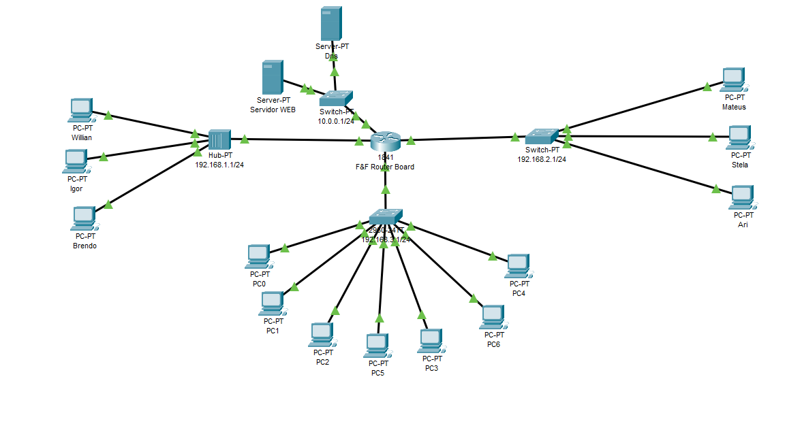

<h1>Curso de redes intraNet</h1>

Esse foi meu projeto final para o curso de criação de uma intranet. Os tópicos abaixo relatam os benéficios que tive ao realizar este curso:

<h3>Consolidação do meu aprendizado</h2>

Embora eu já esteja trabalhando na área de redes há alguns meses e ter conseguido absorver muita coisa nova, esse curso foi fundamental para que eu pudesse
carimbar de vez o que eu aprendi, me certificando de que tudo que eu entendi (e até o que eu não entendi direito).
  

<h3>Novo jeito de pensar</h2>

Aprender coisas novas e enxergar novas possibilidades nos traz tantas ideias na cabeça que é um festival de dopamina,
e agora posso enxergar novos horizontes graças aos conhecimentos adquiridos

<h2>O que foi aprendido?</h2>
<h3>DNS</h3>
<h3>ROTEAMENTO</h3>
<h3>COMUNICAÇÃO ENTRE REDES</h3>
<h3>DIVERSOS PROTOCOLOS (ARP,ICMP,DHCP,TCP...)</h3>

<h2>Agradecimentos</h2>

Primeiramente agradecer as quatro pessoas que me deram 95% de todo conhecimento que eu adquiri de redes, de uma forma didática que eu nunca aprenderia em lugar nenhum.

<ul>
<li>Brendo Nery</li>
  <li>Wallef Igor</li>
   <li>Flávio Silva</li>
   <li>Mateus Oliveira</li>
</ur>

<SPAM>Agradeço também a Alura, pelo ótimo contéudo aplicado e as ferramentas utilziadas</SPAM>

